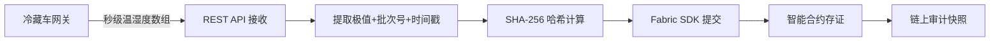
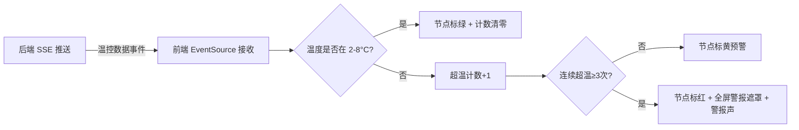

## 1. 产品概述

疫苗冷链监控系统是一套面向医药供应链的实时温控审计与预警平台，解决疫苗运输过程中温度异常无法及时发现与追溯的核心痛点。系统整合 IoT 传感器时序数据上报、SHA-256 哈希上链存证、多温区物流拓扑可视化与 SSE 实时预警四大能力，确保每一支疫苗从仓库到接种点的全程温控可审计、可追溯、不可篡改。

## 2. 核心功能

### 2.1 用户角色

| 角色 | 注册方式 | 核心权限 |
|------|----------|----------|
| 监控调度员 | 管理员分配账号 | 实时监控大屏、告警响应、批次追溯查询 |
| 系统管理员 | 初始化创建 | 全部权限、设备管理、链上审计日志查看 |

### 2.2 功能模块

1. **监控大屏首页**：物流骨干网拓扑图、冷藏车实时温区着色、SSE 实时数据流、全局告警状态
2. **告警中心**：超温事件列表、告警详情、历史告警回放
3. **链上审计**：批次温控快照查询、SHA-256 哈希验证、上链记录时间线

### 2.3 页面详情

| 页面名称 | 模块名称 | 功能描述 |
|----------|----------|----------|
| 监控大屏首页 | 物流拓扑图 | 渲染冷藏车与仓储节点的网络拓扑，节点颜色实时映射温区状态（绿色=安全、黄色=预警、红色=超温） |
| 监控大屏首页 | 实时数据面板 | 显示当前在线车辆数、平均温度、告警数等关键指标 |
| 监控大屏首页 | 超温警报遮罩 | 当任意车辆连续三次超出 2-8°C 黄金温区时，全屏红色闪烁遮罩 + 警报声 |
| 监控大屏首页 | 车辆详情卡片 | 点击拓扑节点弹出该车辆的温湿度曲线、批次号、最新上链哈希 |
| 告警中心 | 告警事件列表 | 分页展示所有超温告警事件，支持按批次号/时间筛选 |
| 告警中心 | 告警详情 | 展示单次告警的三次超温读数详情与上链存证信息 |
| 链上审计 | 批次查询 | 按运输批次号查询所有温控快照记录 |
| 链上审计 | 哈希验证 | 输入原始数据与链上哈希进行 SHA-256 校验，验证数据未被篡改 |
| 链上审计 | 上链时间线 | 可视化展示某批次从发货到收货的全链路上链记录 |

## 3. 核心流程

### 3.1 IoT 数据上链流程

冷藏车网关每秒将温湿度数组通过 REST API 上报到后端，后端提取温度极值与批次号，拼接时间戳后计算 SHA-256 哈希，通过 Fabric SDK 提交到链上智能合约，形成防篡改审计快照。

### 3.2 实时预警流程

后端通过 SSE 长连接将实时温控数据推送到前端，前端根据连续超温次数改变拓扑节点颜色，达到三次触发全屏警报。

## 4. 用户界面设计

### 4.1 设计风格

- **主色调**：深空蓝 (#0A1628) 为底色，冰蓝 (#00D4FF) 为主强调色，警示红 (#FF2D55) 为告警色
- **辅助色**：翠绿 (#00E676) 表示安全温区，琥珀 (#FFB300) 表示预警
- **字体**：标题使用 Rajdhani（科技感显示字体），正文使用 Source Sans 3
- **布局**：深色工业风监控大屏，左中右三栏布局，中栏为拓扑主视觉区
- **图标**：lucide-react 图标库
- **动效**：数据流粒子动画、节点脉冲呼吸、告警闪烁

### 4.2 页面设计概览

| 页面名称 | 模块名称 | UI 元素 |
|----------|----------|---------|
| 监控大屏首页 | 顶部状态栏 | 深蓝背景、冰蓝边框、实时时钟、在线车辆数、告警计数徽标 |
| 监控大屏首页 | 左侧指标面板 | 4个 KPI 卡片（在线车辆/平均温度/告警数/上链数），冰蓝渐变边框 |
| 监控大屏首页 | 中央拓扑图 | SVG/Canvas 拓扑，节点为冷藏车图标，连线为运输路径，颜色映射温区 |
| 监控大屏首页 | 右侧批次面板 | 最近上链批次列表，哈希值截断显示，时间戳 |
| 监控大屏首页 | 超温警报遮罩 | 全屏半透明红色遮罩，脉冲闪烁动画，居中告警文字，自动播放警报声 |
| 告警中心 | 告警列表 | 深色表格，红色行高亮未处理告警，分页控件 |
| 链上审计 | 审计时间线 | 垂直时间线组件，每节点显示哈希与温度极值 |

### 4.3 响应式策略

桌面优先设计，大屏（1920×1080）为最佳适配分辨率。拓扑图支持缩放与拖拽交互。

### 4.4 音效设计

- 超温警报声：使用 Web Audio API 生成 440Hz/880Hz 交替方波警报音，连续三次超温时自动播放
