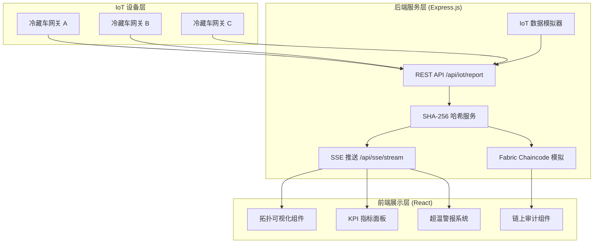
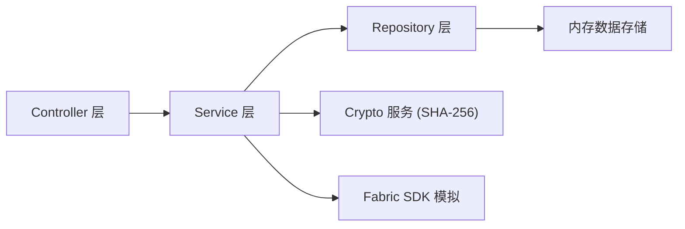
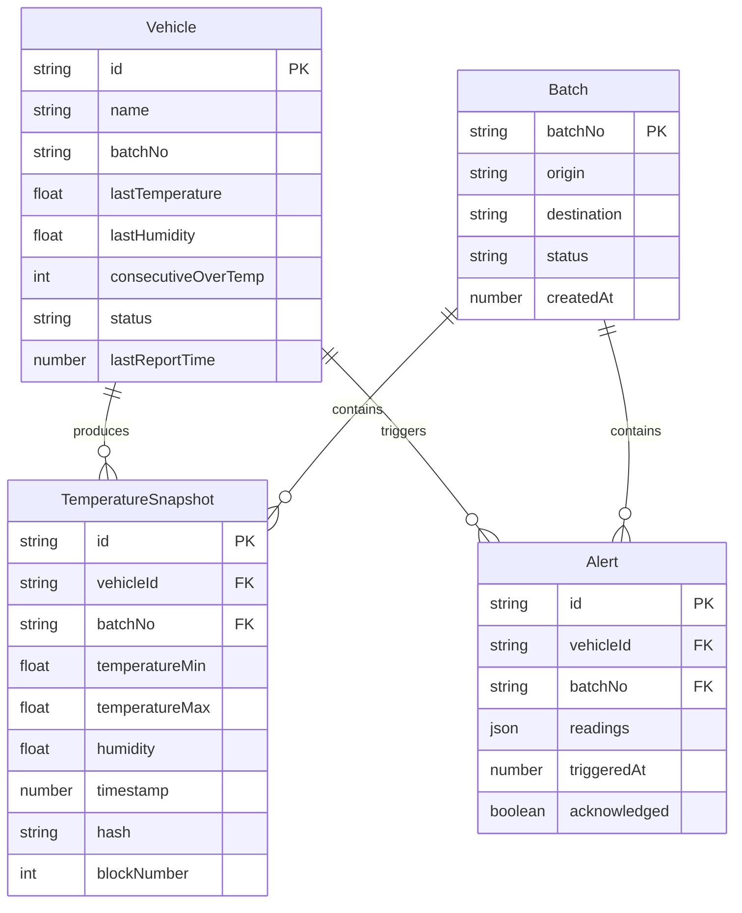

## 1. 架构设计



## 2. 技术说明

- **前端**: React@18 + TypeScript + Tailwind CSS@3 + Vite
- **状态管理**: Zustand
- **后端**: Express@4 + TypeScript (ESM)
- **区块链**: Hyperledger Fabric 模拟（Fabric SDK 调用逻辑完整实现，链上存储使用内存模拟）
- **实时通信**: Server-Sent Events (SSE)
- **加密**: Node.js crypto 模块 (SHA-256)
- **图标**: lucide-react
- **初始化工具**: vite-init

## 3. 路由定义

| 路由 | 用途 |
|------|------|
| `/` | 监控大屏首页 - 拓扑图、实时指标、告警遮罩 |
| `/alerts` | 告警中心 - 超温事件列表与详情 |
| `/audit` | 链上审计 - 批次查询、哈希验证、上链时间线 |

## 4. API 定义

### 4.1 IoT 数据上报

```typescript
POST /api/iot/report

interface IoTReportRequest {
  vehicleId: string;
  batchNo: string;
  readings: {
    timestamp: number;
    temperature: number;
    humidity: number;
    probeId: string;
  }[];
}

interface IoTReportResponse {
  success: boolean;
  hash: string;
  blockNumber: number;
  timestamp: number;
}
```

### 4.2 SSE 事件流

```typescript
GET /api/sse/stream

interface SSEEvent {
  type: "temperature" | "alert" | "blockchain";
  data: {
    vehicleId: string;
    batchNo: string;
    temperature: number;
    humidity: number;
    timestamp: number;
    isOverTemp: boolean;
    consecutiveOverTemp: number;
    hash?: string;
    blockNumber?: number;
  };
}
```

### 4.3 链上审计查询

```typescript
GET /api/audit/batch/:batchNo

interface AuditRecord {
  hash: string;
  blockNumber: number;
  timestamp: number;
  temperatureMin: number;
  temperatureMax: number;
  vehicleId: string;
  batchNo: string;
}

GET /api/audit/verify

interface VerifyRequest {
  originalData: string;
  hash: string;
}

interface VerifyResponse {
  valid: boolean;
  computedHash: string;
  providedHash: string;
}
```

### 4.4 告警查询

```typescript
GET /api/alerts?page=1&pageSize=20&batchNo=

interface AlertRecord {
  id: string;
  vehicleId: string;
  batchNo: string;
  readings: { temperature: number; timestamp: number }[];
  triggeredAt: number;
  acknowledged: boolean;
}
```

## 5. 服务架构图



## 6. 数据模型

### 6.1 数据模型定义



### 6.2 数据定义

系统使用内存数据存储模拟，初始化时预置以下数据：

- 6 辆冷藏车（3 辆正常温区、2 辄边缘温区、1 辆模拟超温）
- 3 个运输批次
- IoT 模拟器每 3 秒自动生成温湿度数据并上报
